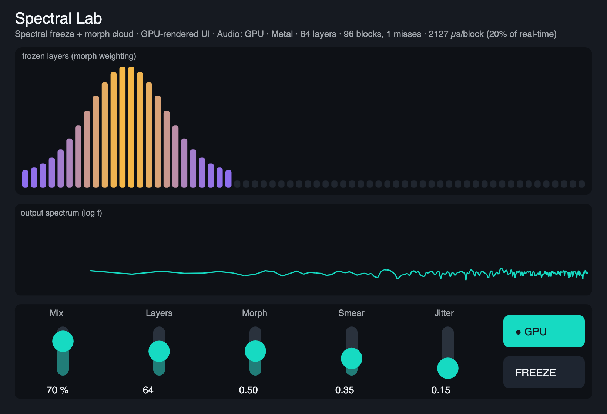

# Spectral Lab

A GPU spectral **freeze + morph** instrument, built on [Pulp](https://github.com/danielraffel/pulp). Signed and notarized for macOS (Apple Silicon).

> Temporary distribution repo for sharing preview builds. The source lives in the Pulp repo (`examples/spectral-lab`).

## What it is

Hit **Freeze** and Spectral Lab captures a frozen spectral "moment" — one snapshot of the sound's frequency content — and sustains it forever as a pad. Freeze again and it captures another **layer**. Stack many layers into a frozen "chord," then use **Morph** to sweep through them, **Smear** to blur each layer across frequency, and **Jitter** to add shimmer. The more layers you stack, the richer the cloud.

Each layer is a held STFT frame: its magnitude is frozen while its phase keeps advancing, so it rings on as a tone. Every hop the engine advances, smears, and weighted-sums *all* the layers and does one inverse FFT.

## An honest take on the GPU

Spectral Lab's audio runs on the **CPU by default**. Stacking many layers is the one job here that genuinely suits a GPU, so there's an opt-in **GPU engine** for it — and this plugin is built to show exactly where that helps and where it doesn't.

The catch with audio on a GPU is the round-trip: moving a block of audio to the device, running a kernel, and reading the result back costs a fixed few hundred microseconds per block. For a handful of layers that overhead is bigger than just doing the work on the CPU, so the CPU wins. The GPU only pulls ahead when there's enough **parallel** work per block to amortize the round-trip — here, *many layers at once*.

### Where the GPU wins (many layers)

Measured on Apple Silicon / Metal, FFT 2048, hop 512 @ 48 kHz. Per-hop real-time budget = 10,667 µs. **Lower µs is better.**

| Layers | CPU µs/hop | GPU µs/hop | speedup |
|-------:|-----------:|-----------:|---------|
| 16  | 1,348 | 812   | 1.7× |
| 64  | 5,402 | 1,161 | 4.0× |
| 128 | 11,520 (**over** the real-time budget) | 1,946 | **5.9× — the CPU can't keep up; the GPU stays smooth** |

At 128 layers the CPU overruns the real-time budget (the audio breaks up); the GPU does the same cloud in under a fifth of the budget.

### Where the GPU does *not* help

A few layers are **faster on the CPU**, because the round-trip dominates:

| Layers | CPU µs/hop | GPU µs/hop | winner |
|-------:|-----------:|-----------:|--------|
| 1 | 96  | 356 | **CPU** |
| 4 | 328 | 475 | **CPU** |

The crossover is around 8 layers, so the CPU stays the default and the GPU engine is there for big clouds. Past the GPU's memory limit it refuses the job rather than fake it.

### Live stats — see it for yourself

The status line reports what the audio engine is actually doing, in real time:

> *Audio: GPU · Metal · 64 layers · 96 blocks, 1 misses · 2127 µs/block (20% of real-time)*

- **Audio: GPU · Metal** — the audio engine and the GPU backend (the picture is always GPU-drawn; this is about the *sound*).
- **64 layers** — frozen layers being summed every block.
- **96 blocks / 1 misses** — blocks the GPU worker delivered vs. blocks it couldn't deliver in time (filled seamlessly another way; a couple at startup is normal).
- **2127 µs/block** — the real measured cost of one block on the GPU path, in microseconds (millionths of a second), round-trip included. Lower is better.
- **20% of real-time** — the headroom gauge: that cost as a percentage of how long the plugin actually has to process a block *on your machine*. 20% means lots of room; add layers and it climbs toward 100%. This is the number that tells you what *your* GPU can handle.

### How we verified it really runs on the GPU

The GPU output matches an independent CPU reference bit-for-bit (cross-correlation = 1.0), the GPU's timing at high layer counts is impossible to hit on the CPU, and a sustained GPU load drives the machine's GPU-utilization counter well above its idle 0%.

## ⚠️ Apple Silicon native — run your host natively (not Rosetta)

These builds are **arm64 (Apple Silicon) only**. A host running under **Rosetta (x86_64)** cannot load an arm64-only plugin. If a plugin won't load:

1. Quit your DAW.
2. In **Applications**, right-click the DAW → **Get Info** → **uncheck "Open using Rosetta"**.
3. Relaunch. (Ableton Live 11.3+, Logic, REAPER, Bitwig all run natively on Apple Silicon.)

## Download

Grab the latest [release](../../releases/latest) — a single notarized installer. Its **Customize** pane lets you pick any of:

- **Audio Unit (AU)** → Logic Pro, GarageBand
- **VST3** → most DAWs
- **CLAP** → REAPER, Bitwig
- **Standalone app** → `SpectralLab.app` in Applications (no DAW needed)

Signed with a Developer ID and notarized by Apple, so it opens without Gatekeeper warnings.

## Controls

- **Mix** — dry/wet.
- **Freeze** — capture the current spectrum into the next layer.
- **Layers** — how many frozen layers to stack (1–128). On the GPU engine this is the knob that makes the GPU worth using.
- **Morph** — sweep a soft weighting across the captured layers (scrub through the frozen chord).
- **Smear** — blur each layer's magnitude across frequency.
- **Jitter** — add per-layer phase wander (shimmer).
- **Engine** — CPU (default) or GPU. CPU for a few layers; GPU for big clouds.

## Requirements

macOS on Apple Silicon (arm64). Run your DAW natively (not under Rosetta).

## Feedback

It's a preview — expect rough edges. Issues and notes welcome.
